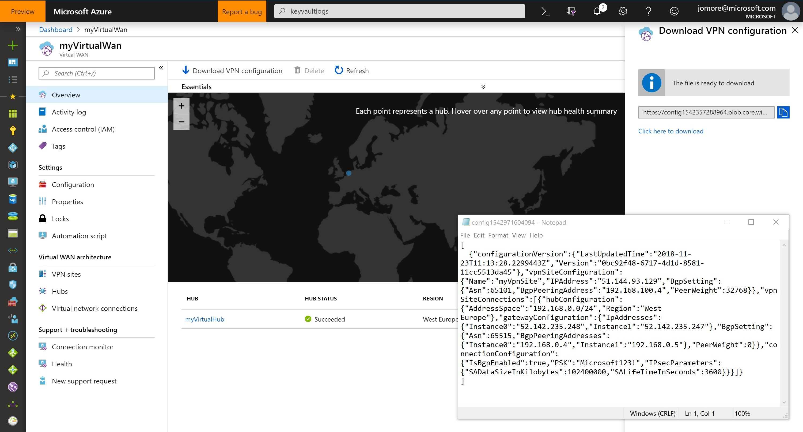

# Azure Virtual WAN lab

## To Do:

* Get BGP working (case opened)
* Branch-to-branch, probably via a new ARM template that deploys NVA+Site+VNG(+Hub?)
* Consolidate CLI/Powershell (this probably means remove CLI, low prio)

## Setup the scenario

**Important**: support for ARM/CLI/Powershell is limited. As quoted in the Virtual WAN FAQ, *Virtual WAN is primarily a REST or Portal driven service*.

This template will generate the following resources:

* A Vnet with an NVA to simulate your onprem device (you can choose between different NVA types, Linux and Cisco CSR 1000v supported at this time)
* A Virtual WAN resource, with a Virtual Hub and a VPN Site, preconfigured with BGP and the public/private IP addresses of the NVA described in the previous bullet

First you need to create a resource group, we will use `vwantest` in `westeurope` along this demo. Use a Powershell console such as Azure Cloud Shell:

```
Azure:/
PS Azure:\> $rg="vwantest"
Azure:/
PS Azure:\> New-AzResourceGroup -name $rg -Location westeurope

ResourceGroupName : vwantest
Location          : westeurope
ProvisioningState : Succeeded
Tags              :
ResourceId        : /subscriptions/.../resourceGroups/vwantest
```

or from Azure CLI, if you prefer: 

```
az group create -n vwantest -l westeurope
```

### Option 1: Linux VPN device on-premises

Now you can issue this command from a Powershell console (such as Azure Cloud Shell):

```
Azure:/
PS Azure:\> $SecurePassword=ConvertTo-SecureString 'yoursupersecretpassword' –asplaintext –Force
Azure:/
PS Azure:\> New-AzResourceGroupDeployment -ResourceGroupName $rg `
   -TemplateUri https://raw.githubusercontent.com/erjosito/azure-wan-lab/master/vwan_quickstart.json `
   -nvaPwd $SecurePassword
```
  
If you prefer to use the Azure CLI on a Linux prompt you can use this syntax: 

```
az group deployment create -g vwantest --template-uri https://raw.githubusercontent.com/erjosito/azure-wan-lab/master/vwan_quickstart.json --parameters '{"nvaPwd":{"value":"yoursupersecretpassword"}}'
```

For commands on Windows you cannot use single quotes, so you need to escape the double quotes in your parameter declaration:

```
az group deployment create -g vwantest --template-uri https://raw.githubusercontent.com/erjosito/azure-wan-lab/master/vwan_quickstart.json --parameters "{\"nvaPwd\":{\"value\":\"yoursupersecretpassword\"}}"
```

The default NVA type is a Linux Ubuntu VM with Quagga (for BGP) and StrongSwan (for VPN). An initial StrongSwan configuration is provided, but you will have to update it with the right parameters corresponding to your VPN site (public IP address, BGP peering IP address, Pre-Shared-Key).

### Option 2: Cisco CSR 1000v VPN device on-premises

If you want to deploy a Cisco CSR 1000v router as NVA to simulate on-premises devices (you do not need any license, since all functionality is active in eval mode, only bandwidth is limited), you can use the parameter nvaType like this:

```
Azure:/
PS Azure:\> $SecurePassword=ConvertTo-SecureString 'yoursupersecretpassword' –asplaintext –Force
Azure:/
PS Azure:\> New-AzResourceGroupDeployment -ResourceGroupName $rg `
   -TemplateUri https://raw.githubusercontent.com/erjosito/azure-wan-lab/master/vwan_quickstart.json `
   -nvaPwd $SecurePassword `
   -nvaType 'cisco_csr'
```

or from CLI (Linux):

```
az group deployment create -g vwantest --template-uri https://raw.githubusercontent.com/erjosito/azure-wan-lab/master/vwan_quickstart.json --parameters '{"nvaPwd":{"value":"yoursupersecretpassword"}, "nvaType":{"value":"cisco_csr"}}'
```

The password you provided in the template will be used for authentication in the NVA, for the user `lab-user` (so it need to be compliant with the VM password policy: 12-character long, numbers, letters, special sign), as well as Pre-Shared Key for VPN. In a production environment you would probably separate both (the ARM template allows to do that).

# Inspect created resources

You can now go to the portal and have a look at the Virtual WAN resources, or you can do it using Powershell. Azure CLI is not supported yet. In case you do not have Powershell installed in your machine, you can leverage the Azure Cloud Shell in https://shell.azure.com.

## Using Powershell

You can go to https://shell.azure.com or install the latest version of the Azure Powershell modules to have access to the Virtual WAN cmdlets. Here some examples that help you understanding the deployed environment, as well as retrieving some interesting information:

```
Azure:/
PS Azure:\> $rg="vwantest"
Azure:/
PS Azure:\> get-azvirtualwan -ResourceGroupName $rg

Name                       : myVirtualWan
Id                         : /subscriptions/your_sub_id/resourceGroups/vwantest/providers/Microsoft.Network/virtualWans/myVirtualWan
AllowVnetToVnetTraffic     : True
AllowBranchToBranchTraffic : True
Location                   : westeurope
Type                       : Microsoft.Network/virtualWans
ProvisioningState          : Succeeded
```

```
Azure:/
PS Azure:\> get-azvirtualhub -ResourceGroupName $rg

VirtualWan                : /subscriptions/your_sub_id/resourceGroups/vwantest/providers/Microsoft.Network/virtualWans/myVirtualWan
ResourceGroupName         : vwantest
Name                      : myVirtualHub
Id                        : /subscriptions/your_sub_id/resourceGroups/vwantest/providers/Microsoft.Network/virtualHubs/myVirtualHub
AddressPrefix             : 192.168.0.0/24
RouteTable                : Microsoft.Azure.Commands.Network.Models.PSVirtualHubRouteTable
VirtualNetworkConnections : {}
Location                  : westeurope
Type                      : Microsoft.Network/virtualHubs
ProvisioningState         : Succeeded
```

```
Azure:/
PS Azure:\> get-azvpnsite -ResourceGroupName $rg

ResourceGroupName : vwantest
Name              : myVpnSite
Id                : /subscriptions/your_sub_id/resourceGroups/vwantest/providers/Microsoft.Network/vpnSites/myVpnSite
Location          : westeurope
IpAddress         : 192.168.100.4
VirtualWan        : /subscriptions/your_sub_id/resourceGroups/vwantest/providers/Microsoft.Network/virtualWans/myVirtualWan
AddressSpace      : 192.168.100.4/32
BgpSettings       :
Type              : Microsoft.Network/vpnSites
ProvisioningState : Succeeded
```

# Configure your NVA

You can get the public IP address of your NVA looking at the public IP addresses in your resource group, for example like this using Powershell:

```
Azure:/
PS Azure:\> Get-AzPublicIpAddress -ResourceGroupName $rg | ft Name,IpAddress

Name      IpAddress
----      ---------
myCsr-pip 51.144.93.129
```

or using CLI:

```
$ az network public-ip list -g vwantest -o tsv --query [].[name,ipAddress]
myCsr-pip       51.144.93.129
```

You can download the VPN configuration from the Azure Portal, in the Overview of your virtual WAN. After your deployment has finalized, you can download a JSON file that contains important information about your environment.

Fig 1: Downloading VPN configuration



**Figure 1.** VPN Config Download From Azure Portal


Here you have a sample VPN configuration file. Indentation has been modified for easier human reading:

```
[
  {"configurationVersion":{
    "LastUpdatedTime":"2018-11-18T13:08:17.5154511Z",
    "Version":"2cb4660d-a96e-4c3a-83a6-648f26dd1411"},
    "vpnSiteConfiguration":{
       "Name":"myVpnSite",
       "IPAddress":"public_ip_address_of_your_NVA",
       "BgpSetting":{"Asn":65101,"BgpPeeringAddress":"192.168.100.4","PeerWeight":32768}},
       "vpnSiteConnections":[{
           "hubConfiguration":{"AddressSpace":"192.168.0.0/24","Region":"West Europe",
           "gatewayConfiguration":{
               "IpAddresses":{"Instance0":"1.2.3.4","Instance1":"5.6.7.8"},
               "BgpSetting":{"Asn":65515,"BgpPeeringAddresses":{"Instance0":"192.168.0.4","Instance1":"192.168.0.5"},"PeerWeight":0}},
               "connectionConfiguration":{"IsBgpEnabled":true,"PSK":"your_password","IPsecParameters":{"SADataSizeInKilobytes":102400000,"SALifeTimeInSeconds":3600}}}]},
]
```

Note that there are two instances of the gateway. In the case above:

* Instance0: private IP 192.168.0.4, public IP 1.2.3.4
* Instance1: private IP 192.168.0.5, public IP 5.6.7.8

You must use the public IP to establish the VPN tunnel, and the private IP for your BGP adjacency. Make sure that you do not mix the values. For example, if you establish a VPN tunnel to Instance0 and over that tunnel you try to establish a BGP adjacency to 192.168.0.5, that will not work.

Notice that you can connect to both instances at the same time for redundancy. We will see that later in the lab.

## Configuring a Linux-based NVA

There are two parts to it: configuring the VPN connection, and configuring BGP

### Configuring Quagga

After logging into your VM via SSH (default username is `lab-user`, and you provided the password when deploying the ARM template), you can connect to the VPN console with the command `sudo vtysh`. Here you can use Cisco-like commands (like for example `show running-conf` or `config t`) to define your BGP configuration.

You can get the IP address for the BGP neighbor from your site configuration.

### Configuring StrongSwan

There is a guide that you can find (here)[https://github.com/Azure/Azure-vpn-config-samples/tree/master/StrongSwan/5.3.5]. You will find the files from this repo already copied into your VM, but you will need to edit them with the right values for your VPN site.


## Configuring a Cisco CSR 1000v NVA

After the deployment, you can connect to the CSR CLI via SSH (default username is `lab-user`, and you provided the password when deploying the ARM template). Here you have an example configuration, where these parameters have been used:

* Virtual Hub public IP address (endpoint for the IPsec tunnel): 1.2.3.4
* Virtual Hub BGP peering IP address (you need to use this as your neighbor IP): x.y.z
* Virtual Hub BGP ASN: 65515
* CSR BGP peering IP address (should be the IP address for interface GigabitEthernet1): 192.168.100.4
* CSR BGP ASN: 65101

You can copy this config into a text editor, replace the parameters specific to your environment (public IP addresses, BGP neighbor IP address)

```
crypto ikev2 proposal azure-proposal
  encryption aes-cbc-256 aes-cbc-128 3des
  integrity sha1
  group 2
  exit
!
crypto ikev2 policy azure-policy
  proposal azure-proposal
  exit
!
crypto ikev2 keyring azure-keyring
  peer 1.2.3.4
    address 1.2.3.4
    pre-shared-key Microsoft123!
    exit
  exit
!
crypto ikev2 profile azure-profile
  match address local interface GigabitEthernet1
  match identity remote address 1.2.3.4 255.255.255.255
  authentication remote pre-share
  authentication local pre-share
  keyring local azure-keyring
  exit
!
crypto ipsec transform-set azure-ipsec-proposal-set esp-aes 256 esp-sha-hmac
 mode tunnel
 exit

crypto ipsec profile azure-vti
  set transform-set azure-ipsec-proposal-set
  set ikev2-profile azure-profile
  set security-association lifetime kilobytes 102400000
  set security-association lifetime seconds 3600 
 exit
!
interface Tunnel0
 ip unnumbered GigabitEthernet1 
 ip tcp adjust-mss 1350
 tunnel source GigabitEthernet1
 tunnel mode ipsec ipv4
 tunnel destination 1.2.3.4
 tunnel protection ipsec profile azure-vti
exit
!
router bgp 65101
 bgp router-id interface GigabitEthernet1
 bgp log-neighbor-changes
 neighbor 192.168.0.4 remote-as 65515
 neighbor 192.168.0.4 ebgp-multihop 5
 neighbor 192.168.0.4 update-source GigabitEthernet1
!
ip route 192.168.0.4 255.255.255.255 Tunnel0
```

Do not forget to save your configuration!

Now you can verify that the IPSec tunnel has been established. The first step is verifying that the state of your IKE Security Association is `READY`:

```
myCsr#show crypto ike sa
 IPv4 Crypto IKEv2  SA

Tunnel-id Local                 Remote                fvrf/ivrf            Status
2         192.168.100.4/4500    52.142.235.248/4500   none/none            READY
      Encr: AES-CBC, keysize: 256, PRF: SHA1, Hash: SHA96, DH Grp:2, Auth sign: PSK, Auth verify: PSK
      Life/Active Time: 86400/88 sec

 IPv6 Crypto IKEv2  SA
```

You can explore the state of the IPsec Security Associations too, like the encrypted/decrypted packets:

```
myCsr#show crypto ipsec sa | i pkt
    #pkts encaps: 4, #pkts encrypt: 4, #pkts digest: 4
    #pkts decaps: 12, #pkts decrypt: 12, #pkts verify: 12
    #pkts compressed: 0, #pkts decompressed: 0
    #pkts not compressed: 0, #pkts compr. failed: 0
    #pkts not decompressed: 0, #pkts decompress failed: 0
```

If you remove the filter (`show crypto ipsec sa`) to get additional information on your two IPsec SAs (you will have at least two, since IPsec SAs are unidirectional).

Lastly, verify that the BGP adjacency is up:

```
myCsr#sh ip bgp summ
...
Neighbor        V           AS MsgRcvd MsgSent   TblVer  InQ OutQ Up/Down  State/PfxRcd
192.168.0.4     4        65515       3       2        1    0    0 00:00:10        2
```

As you can see, the BGP adjacency is up, and we have received two prefixes. Let us have a look at them:

```
myCsr#sh ip bgp
BGP table version is 3, local router ID is 192.168.100.4
...
     Network          Next Hop            Metric LocPrf Weight Path
 r>   192.168.0.0      192.168.0.4                            0 65515 i
 r>   192.168.100.4/32 192.168.0.4                            0 65515 i
```

Unsurprisingly enough, it is just information about the router ID itself that the Azure Virtual WAN instance is using (192.168.100.4), but no prefix from anything else, since there is no Vnet attached yet. We will do that in our next step.

**Note:** You could add a new VPN/BGP connection to the second gateway instance, to have redundancy at the Azure Virtual Network Gateway level.

# Deploy a test vnet

We will now deploy a VM in Azure, and check we have connectivity over the IPsec tunnel.

```
PS Azure:\> New-AzResourceGroupDeployment -ResourceGroupName $rg `
   -TemplateUri https://raw.githubusercontent.com/erjosito/azure-wan-lab/master/vmLinux.json `
   -vmName 'testvm1' `
   -vmPwd $SecurePassword `
   -vnetName 'testvnet1' `
   -vnetPrefix '10.0.1.0/24' `
   -subnetPrefix '10.0.1.0/26'
```

Or if you prefer CLI:

```
 az group deployment create -g vwantest --template-uri https://raw.githubusercontent.com/erjosito/azure-wan-lab/master/vmLinux.json --parameters '{"vmPwd":{"value":"Microsoft123!"}, "vnetName":{"value":"testvnet1"}, "vnetPrefix":{"value":"10.0.1.0/24"}, "subnetPrefix":{"value":"10.0.1.0/26"}, "vmName":{"value":"testvm1"}}'
```

You need to configure the peering between the Vnet and the Hub in the portal (from the virtual Hub screen). The reason is because the Vnet associated to the virtual hub is not in the same subscription:

```
Azure:/
PS Azure:\> Get-AzVirtualNetworkPeering -ResourceGroupName $rg -VirtualNetworkName testvnet1

Name                             : RemoteVnetToHubPeering_ac259ec9-0aca-4d2a-8431-9f67bf6e58f3
Id                               : /subscriptions/e7da9914-9b05-4891-893c-546cb7b0422e/resourceGroups/vwantest/providers/Microsoft.Network/virtualNetworks/testvnet1/virtualNetworkPeerings/RemoteVnetToHubPeering
                                   _ac259ec9-0aca-4d2a-8431-9f67bf6e58f3
Etag                             : W/"157182e8-f9d0-4fae-8ddc-9354d879e7cd"
ResourceGroupName                : vwantest
VirtualNetworkName               : testvnet1
PeeringState                     : Connected
ProvisioningState                : Succeeded
RemoteVirtualNetwork             : {
                                     "Id": "/subscriptions/4cd6662f-87e7-4798-97b8-bab6a011b145/resourceGroups/RG_myVirtualHub_053f87d4-bfd8-4ba5-b313-3a59d84f7e33/providers/Microsoft.Network/virtualNetworks/HV_myVirtualHub_9242ce03-1745-4a20-ac27-0df11fa5f048"
                                   }
AllowVirtualNetworkAccess        : True
AllowForwardedTraffic            : False
AllowGatewayTransit              : False
UseRemoteGateways                : True
RemoteGateways                   : null
RemoteVirtualNetworkAddressSpace : null
```

Notice the settings of the peering, especially how UseRemoteGateways is set to True.

Let us have a look at the effective routing table of our test VM:

```
Azure:/
PS Azure:\> Get-AzEffectiveRouteTable -NetworkInterfaceName testvm1-nic -ResourceGroupName $rg | ft

Name State  Source                AddressPrefix      NextHopType           NextHopIpAddress
---- -----  ------                -------------      -----------           ----------------
     Active Default               {10.0.1.0/24}      VnetLocal             {}
     Active Default               {192.168.0.0/24}   VNetPeering           {}
     Active VirtualNetworkGateway {192.168.100.4/32} VirtualNetworkGateway {192.168.0.4}
     Active Default               {0.0.0.0/0}        Internet              {}
     Active Default               {10.0.0.0/8}       None                  {}
     Active Default               {100.64.0.0/10}    None                  {}
     Active Default               {172.16.0.0/12}    None                  {}
     Active Default               {192.168.0.0/16}   None                  {}
```

Or with Azure CLI if you prefer:

```
$ az network nic list -g vwantest -o tsv --query [].name
myCsr-nic
testvm1-nic
$ az network nic show-effective-route-table -n testvm1-nic -g vwantest -o table
10.0.1.0/24     null    VnetLocal
192.168.0.0/24  null    VNetPeering
192.168.100.4/32        192.168.0.4     VirtualNetworkGateway
0.0.0.0/0       null    Internet
10.0.0.0/8      null    None
100.64.0.0/10   null    None
172.16.0.0/12   null    None
192.168.0.0/16  null    None
```

Notice the entry for 192.168.100.4 of the type VirtualNetworkGateway where the next hop is 192.168.0.4, and how 192.168.0.0/24 is reachable over the Vnet Peering conenction.

You can now SSH to the VM in the new Vnet and try to reach the onprem VPN gateway (192.168.100.4):

```
Azure:/
PS Azure:\> Get-AzPublicIpAddress -ResourceGroupName $rg | ft Name,IpAddress

Name        IpAddress
----        ---------
myCsr-pip   51.144.97.23
testvm1-pip 51.144.122.127

Azure:/
PS Azure:\> ssh lab-user@51.144.122.127
...output omitted...
lab-user@testvm1:~$ ping 192.168.100.4
PING 192.168.100.4 (192.168.100.4) 56(84) bytes of data.
64 bytes from 192.168.100.4: icmp_seq=1 ttl=255 time=7.55 ms
64 bytes from 192.168.100.4: icmp_seq=2 ttl=255 time=4.82 ms
64 bytes from 192.168.100.4: icmp_seq=3 ttl=255 time=4.52 ms
^C
--- 192.168.100.4 ping statistics ---
3 packets transmitted, 3 received, 0% packet loss, time 2003ms
rtt min/avg/max/mdev = 4.520/5.630/7.551/1.365 ms
lab-user@testvm1:~$
```

or with Azure CLI:

```
$ az network public-ip list -g vwantest -o tsv --query [].[name,ipAddress]
myCsr-pip    51.144.93.129
testvm1-pip  13.80.66.27
$ ssh lab-user@13.80.66.27
lab-user@13.80.66.27's password:
lab-user@testvm1:~$
lab-user@testvm1:~$ ping 192.168.100.4
lab-user@testvm1:~$ ping 192.168.100.4
PING 192.168.100.4 (192.168.100.4) 56(84) bytes of data.
64 bytes from 192.168.100.4: icmp_seq=1 ttl=255 time=7.52 ms
64 bytes from 192.168.100.4: icmp_seq=2 ttl=255 time=5.26 ms
^C
```

We can have a look at the routing table on our on-premises device as well:

```
myCsr#show ip route bgp
...
      10.0.0.0/24 is subnetted, 1 subnets
B        10.0.1.0 [20/0] via 192.168.0.4, 00:06:05
```


# Deploy a second test vnet, peered to the first one

Let us simulate a hub&spoke network design in Azure. For that we will add a second vnet, that we will peer to the first one: 

```
PS Azure:\> New-AzResourceGroupDeployment -ResourceGroupName $rg `
   -TemplateUri https://raw.githubusercontent.com/erjosito/azure-wan-lab/master/vmLinux.json `
   -vmName 'testvm2' `
   -vmPwd $SecurePassword `
   -vnetName 'testvnet2' `
   -vnetPrefix '10.0.2.0/24' `
   -subnetPrefix '10.0.2.0/26'
```

Or with Azure CLI:

```
 az group deployment create -g vwantest --template-uri https://raw.githubusercontent.com/erjosito/azure-wan-lab/master/vmLinux.json --parameters '{"vmPwd":{"value":"Microsoft123!"}, "vnetName":{"value":"testvnet2"}, "vnetPrefix":{"value":"10.0.2.0/24"}, "subnetPrefix":{"value":"10.0.2.0/26"}, "vmName":{"value":"testvm2"}}'
```

The ARM template does not create the peerings, so let us do it manually:

```
$vnet1 = Get-AzVirtualNetwork -ResourceGroupName $rg -Name testvnet1
$vnet2 = $(Get-AzVirtualNetwork -ResourceGroupName $rg -Name testvnet2
Add-AzVirtualNetworkPeering -Name Vnet1toVnet2 -VirtualNetwork $vnet1 -RemoteVirtualNetworkId $vnet2.Id -AllowForwardedTraffic
Add-AzVirtualNetworkPeering -Name Vnet2toVnet1 -VirtualNetwork $vnet1 -RemoteVirtualNetworkId $vnet2.Id
```


Or with CLI:

```
$ az network vnet list -g vwantest -o table --query [].[name,id]
Column1    Column2
---------  ---------------------------------------------------------------------------------------------------------------------------------
myVnet     /subscriptions/e7da9914-9b05-4891-893c-546cb7b0422e/resourceGroups/vwantest/providers/Microsoft.Network/virtualNetworks/myVnet
testvnet1  /subscriptions/e7da9914-9b05-4891-893c-546cb7b0422e/resourceGroups/vwantest/providers/Microsoft.Network/virtualNetworks/testvnet1
testvnet2  /subscriptions/e7da9914-9b05-4891-893c-546cb7b0422e/resourceGroups/vwantest/providers/Microsoft.Network/virtualNetworks/testvnet2
$
$ testvnet1id=$(az network vnet show -n testvnet1 -g vwantest --query id -o tsv)
$ testvnet2id=$(az network vnet show -n testvnet2 -g vwantest --query id -o tsv)
$ az network vnet peering create -g vwantest -n Vnet1ToVnet2 --vnet-name testvnet1 --remote-vnet-id $testvnet2id --allow-vnet-access --allow-gateway-transit
$ az network vnet peering create -g vwantest -n Vnet2ToVnet1 --vnet-name testvnet2 --remote-vnet-id $testvnet1id --allow-vnet-access --use-remote-gateways
Peering /subscriptions/e7da9914-9b05-4891-893c-546cb7b0422e/resourceGroups/vwantest/providers/Microsoft.Network/virtualNetworks/testvnet2/virtualNetworkPeerings/Vnet2ToVnet1 cannot have UseRemoteGateway flag set to true because remote virtual network /subscriptions/e7da9914-9b05-4891-893c-546cb7b0422e/resourceGroups/vwantest/providers/Microsoft.Network/virtualNetworks/testvnet1 referenced by the peering does not have any gateways.
$ az network vnet peering create -g vwantest -n Vnet2ToVnet1 --vnet-name testvnet2 --remote-vnet-id $testvnet1id --allow-vnet-access
```

Note how we could set the flag `allow-gateway-transit` for the peering vnet1-to-vnet2, but we could not set the flag `use-remote-gateways` for the peering vnet2-to-vnet1.

You can verify the state of the peerings either with the CLI (`az network vnet peering list --vnetname testvnet1 -g vwantest`) or with Powershell (`get-azvirtualnetworkpeering -ResourceGroupName vwantest -VirtualNetworkName testvnet1 | ft Name,PeeringState`).

Let's have a look at the routing table of the VM in our spoke Vnet (testvnet2):

```
Azure:/
PS Azure:\> Get-AzEffectiveRouteTable -NetworkInterfaceName testvm2-nic -ResourceGroupName vwantest | ft

Name State  Source  AddressPrefix    NextHopType NextHopIpAddress
---- -----  ------  -------------    ----------- ----------------
     Active Default {10.0.2.0/24}    VnetLocal   {}
     Active Default {10.0.1.0/24}    VNetPeering {}
     Active Default {0.0.0.0/0}      Internet    {}
     Active Default {10.0.0.0/8}     None        {}
     Active Default {100.64.0.0/10}  None        {}
     Active Default {172.16.0.0/12}  None        {}
     Active Default {192.168.0.0/16} None        {}
```

As expected, no route for 192.168.100.4/32 and no route for 192.168.0.0/24, since in this case testvnet2 and the vnet in the Virtual Hub act as two spokes. Additionally, if you were to check the routing table in the on-prem router, you would see that the spoke router is not known there. The problem here is that even if you wanted to install an UDR, which next hop would you define? The only possibility would be having an NVA in testvnet1, that would then forward the traffic to the virtual hub. Let us use the VM we had in the first Vnet as appliance, and forward traffic to it.


```
$ az network route-table create -n testvnet2-routes -g vwantest
$ az network vnet subnet update -n subnet1 --vnet-name testvnet2 -g vwantest --route-table testvnet2-routes
$ az network route-table route create -g vwantest --route-table-name testvnet2-routes -n branch1 --next-hop-type VirtualAppliance --address-prefix 192.168.100.0/24 --next-hop-ip-address 10.0.1.4                                                                             
```

```
$ az network public-ip list -g vwantest --query [].[name,ipAddress] -o tsv
myCsr-pip       113.81.244.93
testvm1-pip     13.80.66.27
testvm2-pip     23.97.243.110
$ ssh lab-user@13.80.66.27
Password:
lab-user@testvm1:~$ sudo -i sysctl -w net.ipv4.ip_forward=1
lab-user@testvm1:~$ exit
```

```
$ az network nic list -g vwantest -o tsv --query [].[name,enableIpForwarding]
myCsr-nic       False
testvm1-nic     False
testvm2-nic     False
$ az network nic update -n testvm1-nic -g vwantest --ip-forwarding True
```


```
Azure:/
PS Azure:\> $route = New-AzVirtualHubRoute -AddressPrefix 10.0.2.0/24 -NextHopIpAddress 10.0.1.4
Azure:/
PS Azure:\> $routeTable = New-AzVirtualHubRouteTable -route $route
Azure:/
PS Azure:\> Update-AzVirtualhub -ResourceGroupName vwantest -name myVirtualHub -RouteTable $routetable


VirtualWan                : /subscriptions/e7da9914-9b05-4891-893c-546cb7b0422e/resourceGroups/vwantest/providers/Microsoft.Network/virtualWans/myVirtualWan
ResourceGroupName         : vwantest
Name                      : myVirtualHub
Id                        : /subscriptions/e7da9914-9b05-4891-893c-546cb7b0422e/resourceGroups/vwantest/providers/Microsoft.Network/virtualHubs/myVirtualHub
AddressPrefix             : 192.168.0.0/24
RouteTable                : Microsoft.Azure.Commands.Network.Models.PSVirtualHubRouteTable
VirtualNetworkConnections : {vnet1}
Location                  : westeurope
Type                      : Microsoft.Network/virtualHubs
ProvisioningState         : Succeeded
```

You can verify the routes in your Virtual Hub with this command:

```
PS C:\Users\jomore> $(Get-AzVirtualHub -ResourceGroupName vwantest -Name myVirtualHub).RouteTable.Routes

AddressPrefixes NextHopIpAddress
--------------- ----------------
{10.0.2.0/24}   10.0.1.4
```


Verify routing at the Vnets:

```
Azure:/
PS Azure:\> Get-AzEffectiveRouteTable -NetworkInterfaceName testvm1-nic -ResourceGroupName vwantest | ft

Name State  Source                AddressPrefix      NextHopType           NextHopIpAddress
---- -----  ------                -------------      -----------           ----------------
     Active Default               {10.0.1.0/24}      VnetLocal             {}
     Active Default               {192.168.0.0/24}   VNetPeering           {}
     Active Default               {10.0.2.0/24}      VNetPeering           {}
     Active VirtualNetworkGateway {192.168.100.4/32} VirtualNetworkGateway {192.168.0.4}
     Active Default               {0.0.0.0/0}        Internet              {}
     Active Default               {10.0.0.0/8}       None                  {}
     Active Default               {100.64.0.0/10}    None                  {}
     Active Default               {172.16.0.0/12}    None                  {}
     Active Default               {192.168.0.0/16}   None                  {}


Azure:/
PS Azure:\> Get-AzEffectiveRouteTable -NetworkInterfaceName testvm2-nic -ResourceGroupName vwantest | ft

Name    State  Source  AddressPrefix      NextHopType      NextHopIpAddress
----    -----  ------  -------------      -----------      ----------------
        Active Default {10.0.2.0/24}      VnetLocal        {}
        Active Default {10.0.1.0/24}      VNetPeering      {}
        Active Default {0.0.0.0/0}        Internet         {}
        Active Default {10.0.0.0/8}       None             {}
        Active Default {100.64.0.0/10}    None             {}
        Active Default {172.16.0.0/12}    None             {}
        Active Default {192.168.0.0/16}   None             {}
branch1 Active User    {192.168.100.0/24} VirtualAppliance {10.0.1.4}
```

However, if you have a look at your router, there is no additional route learnt from the spoke:

```
myCsr#sh ip route bgp
...
Gateway of last resort is 192.168.100.1 to network 0.0.0.0

      10.0.0.0/24 is subnetted, 1 subnets
B        10.0.1.0 [20/0] via 192.168.0.4, 04:33:25
myCsr#
```

Let us do one last check: the effective Network Security Group rules. For example on the first VM:

```
Azure:/
PS Azure:\> $(Get-AzEffectiveNetworkSecurityGroup -NetworkInterfaceName testvm1-nic -ResourceGroupName vwantest).EffectiveSecurityRules | ft

Name                                               Protocol SourcePortRange DestinationPortRange SourceAddressPrefix DestinationAddressPrefix ExpandedSourceAddressPrefix                                     ExpandedDestinationA
                                                                                                                                                                                                              ddressPrefix
----                                               -------- --------------- -------------------- ------------------- ------------------------ ---------------------------                                     --------------------
securityRules/SSH                                  Tcp      {0-65535}       {22-22}              {0.0.0.0/0}         {0.0.0.0/0}              {}                                                              {}
defaultSecurityRules/AllowVnetInBound              All      {0-65535}       {0-65535}            {VirtualNetwork}    {VirtualNetwork}         {10.0.1.0/24, 10.0.2.0/24, 168.63.129.16/32, 192.168.0.0/24...} {10.0.1.0/24, 10....
defaultSecurityRules/AllowAzureLoadBalancerInBound All      {0-65535}       {0-65535}            {AzureLoadBalancer} {0.0.0.0/0}              {168.63.129.16/32}                                              {}
defaultSecurityRules/DenyAllInBound                All      {0-65535}       {0-65535}            {0.0.0.0/0}         {0.0.0.0/0}              {}                                                              {}
defaultSecurityRules/AllowVnetOutBound             All      {0-65535}       {0-65535}            {VirtualNetwork}    {VirtualNetwork}         {10.0.1.0/24, 10.0.2.0/24, 168.63.129.16/32, 192.168.0.0/24...} {10.0.1.0/24, 10....
defaultSecurityRules/AllowInternetOutBound         All      {0-65535}       {0-65535}            {0.0.0.0/0}         {Internet}               {}                                                              {1.0.0.0/8, 2.0.0...
defaultSecurityRules/DenyAllOutBound               All      {0-65535}       {0-65535}            {0.0.0.0/0}         {0.0.0.0/0}              {}                                                              {}

```

Since we did not get the full list of expanded prefixes for the NSG tag VirtualNetwork, we can focus on one of the entries:

```
Azure:/
PS Azure:\> $(Get-AzEffectiveNetworkSecurityGroup -NetworkInterfaceName testvm1-nic -ResourceGroupName vwantest).EffectiveSecurityRules[1].ExpandedSourceAddressPrefix
10.0.1.0/24
10.0.2.0/24
168.63.129.16/32
192.168.0.0/24
192.168.100.4/32
```

You can draw a couple of conclusions of the previous outputs:

* As expected, both Vnet IP ranges (`10.0.1.0/24` and `10.0.2.0/24`) as well as the Virtual Hub (192.168.0.0/24) are included
* Note that 

Let us check the same in the spoke. First an overview on the effective rules:

```
PS C:\Users\jomore> $(Get-AzEffectiveNetworkSecurityGroup -NetworkInterfaceName testvm2-nic -ResourceGroupName vwantest).EffectiveSecurityRules | ft

Name                                               Protocol SourcePortRange DestinationPortRange SourceAddressPrefix DestinationAddressPrefix ExpandedSourceAddressPrefix                                    ExpandedDestinationAd
                                                                                                                                                                                                             dressPrefix
----                                               -------- --------------- -------------------- ------------------- ------------------------ ---------------------------                                    ---------------------
securityRules/SSH                                  Tcp      {0-65535}       {22-22}              {0.0.0.0/0}         {0.0.0.0/0}              {}                                                             {}
defaultSecurityRules/AllowVnetInBound              All      {0-65535}       {0-65535}            {VirtualNetwork}    {VirtualNetwork}         {10.0.1.0/24, 10.0.2.0/24, 168.63.129.16/32, 192.168.100.0/24} {10.0.1.0/24, 10.0...
defaultSecurityRules/AllowAzureLoadBalancerInBound All      {0-65535}       {0-65535}            {AzureLoadBalancer} {0.0.0.0/0}              {168.63.129.16/32}                                             {}
defaultSecurityRules/DenyAllInBound                All      {0-65535}       {0-65535}            {0.0.0.0/0}         {0.0.0.0/0}              {}                                                             {}
defaultSecurityRules/AllowVnetOutBound             All      {0-65535}       {0-65535}            {VirtualNetwork}    {VirtualNetwork}         {10.0.1.0/24, 10.0.2.0/24, 168.63.129.16/32, 192.168.100.0/24} {10.0.1.0/24, 10.0...
defaultSecurityRules/AllowInternetOutBound         All      {0-65535}       {0-65535}            {0.0.0.0/0}         {Internet}               {}                                                             {1.0.0.0/8, 2.0.0....
defaultSecurityRules/DenyAllOutBound               All      {0-65535}       {0-65535}            {0.0.0.0/0}         {0.0.0.0/0}              {}                                                             {}
```

Here we do not need to look further. Since there is no ellipsis (three dots or `...`) in the `ExpandedSourceAddressPrefix` field, we do not need to look forward into it. From the previous output you can already see that only the virtual site IP address space (`192.168.100.0/24`) is there. Note this is coming from the UDR we previously defined, not from the Virtual WAN configuration (otherwise we would see `192.168.100.4/32`, as in the hub vnet)

So you have two options: either you peer the spoke to the virtual hub, as [the documentation](https://docs.microsoft.com/en-us/azure/virtual-wan/virtual-wan-faq#is-there-support-for-bgp) suggests, or you add a static route to the router so that it knows how to reach the spoke:

```
myCsr(config)#ip route 10.0.2.0 255.255.255.0 10.0.1.4
```


Et voilâ!

```
lab-user@testvm2:~$ ping 192.168.100.4
PING 192.168.100.4 (192.168.100.4) 56(84) bytes of data.
64 bytes from 192.168.100.4: icmp_seq=1 ttl=254 time=7.58 ms
64 bytes from 192.168.100.4: icmp_seq=2 ttl=254 time=6.42 ms
64 bytes from 192.168.100.4: icmp_seq=3 ttl=254 time=6.09 ms
64 bytes from 192.168.100.4: icmp_seq=4 ttl=254 time=6.74 ms
64 bytes from 192.168.100.4: icmp_seq=5 ttl=254 time=6.04 ms
```


Let us do something, let us inject a new route from our branch, and see what happens. We will create a loopback interface in our router, and redistribute the connected route:

```
myCsr#conf t
Enter configuration commands, one per line.  End with CNTL/Z.
myCsr(config)#int lo0
myCsr(config-if)#ip add 172.16.0.1 255.255.255.0
myCsr(config-if)#no shut
myCsr(config-if)#router bgp 65101
myCsr(config-router)#redistribute connected
myCsr(config-router)# exit
myCsr#
```

Now let us see if the route pops up in Vnet1:

```
Azure:/ 
PS Azure:\> Get-AzEffectiveRouteTable -NetworkInterfaceName testvm1-nic -ResourceGroupName vwantest | ft

Name State  Source                AddressPrefix      NextHopType           NextHopIpAddress
---- -----  ------                -------------      -----------           ----------------
     Active Default               {10.0.1.0/24}      VnetLocal             {}
     Active Default               {192.168.0.0/24}   VNetPeering           {}
     Active Default               {10.0.2.0/24}      VNetPeering           {}
     Active VirtualNetworkGateway {192.168.100.4/32} VirtualNetworkGateway {192.168.0.4}
     Active VirtualNetworkGateway {192.168.100.0/26} VirtualNetworkGateway {192.168.0.4}
     Active VirtualNetworkGateway {172.16.0.0/24}    VirtualNetworkGateway {192.168.0.4}
     Active Default               {0.0.0.0/0}        Internet              {}
     Active Default               {10.0.0.0/8}       None                  {}
     Active Default               {100.64.0.0/10}    None                  {}
     Active Default               {172.16.0.0/12}    None                  {}
     Active Default               {192.168.0.0/16}   None                  {}
```

Excellent (note the 172.16.0.0/24 prefix, not the /12)! What about Vnet2, the spoke?

```
Oh, it is not there. Again, because Vnet peering is not propagating routes over two peerings (from spoke to spoke). Here again the same solution: either peering the spoke directly to the hub, or configuring an UDR in the spoke for the remote network (172.16.0.0/24)
```

What about the NSG tag resolution? Let us check the hub first:

```
Azure:/ 
PS Azure:\> $(Get-AzEffectiveNetworkSecurityGroup -NetworkInterfaceName testvm1-nic -ResourceGroupName vwantest).EffectiveSecurityRules[1].ExpandedSourceAddressPrefix
10.0.1.0/24
10.0.2.0/24
168.63.129.16/32
172.16.0.0/24
192.168.0.0/24
192.168.100.0/26
```

Yepp, in the hub the VirtualNetwork tag is correctly resolved including the remote branch IP prefix (`172.16.0.0/24`). By the way, you can see that our branch is now advertising another additional route, the `192.168.100.0/26` (it is the subnet where the router's interface is configured). What about the spoke?

```
Azure:/ 
PS Azure:\> $(Get-AzEffectiveNetworkSecurityGroup -NetworkInterfaceName testvm2-nic -ResourceGroupName vwantest).EffectiveSecurityRules[1].ExpandedSourceAddressPrefix
10.0.1.0/24
10.0.2.0/24
168.63.129.16/32
192.168.100.0/24
```

As you might have expected, not there (only the IP address range statically defined in our UDR `192.168.100.0/24` is included, but nothing coming from the Virtual WAN).


# Deploy a VWAN with two hubs and one branch in each hub

The following commands will deploy a virtual WAN resource, two hubs (one in West Europe, the other one in West US 2), one site associated to each hub, one vnet in each region that you can peer to each hub, and two Cisco CSR NVAs in their own vnet, that you can use to simulate branches:

```
# Initialization
rg=vwan
password=yoursupersecurepassword # Or better, take it from your Key Vault
az group create -n $rg -l westeurope

# Create VWAN, hubs, sites, NVAs to simulate branches
az group deployment create -n hub1 -g $rg --template-uri https://raw.githubusercontent.com/erjosito/azure-wan-lab/master/vwan_quickstart.json --parameters "{\"nvaPwd\":{\"value\":\"$password\"}, \"nvaType\":{\"value\":\"cisco_csr\"}, \"hubName\":{\"value\":\"myHub1\"}, \"hubPrefix\":{\"value\":\"192.168.1.0/24\"}, \"hubLocation\":{\"value\":\"westeurope\"}, \"siteName\":{\"value\":\"mySite1\"}, \"siteAsn\":{\"value\":65101}, \"branchVnetPrefix\":{\"value\": \"192.168.101.0/24\"}, \"branchSubnetPrefix\":{\"value\": \"192.168.101.0/26\"}}"
az group deployment create -n hub2 -g $rg --template-uri https://raw.githubusercontent.com/erjosito/azure-wan-lab/master/vwan_quickstart.json --parameters "{\"nvaPwd\":{\"value\":\"$password\"}, \"nvaType\":{\"value\":\"cisco_csr\"}, \"hubName\":{\"value\":\"myHub2\"}, \"hubPrefix\":{\"value\":\"192.168.2.0/24\"}, \"hubLocation\":{\"value\":\"westus2\"}, \"siteName\":{\"value\":\"mySite2\"}, \"siteAsn\":{\"value\":65102}, \"branchVnetPrefix\":{\"value\": \"192.168.102.0/24\"}, \"branchSubnetPrefix\":{\"value\": \"192.168.102.0/26\"}}"

# Create vnets to be attached to the hub
az group deployment create -g $rg --template-uri https://raw.githubusercontent.com/erjosito/azure-wan-lab/master/vmLinux.json --parameters "{\"vmPwd\":{\"value\":\"$password\"}, \"vnetName\":{\"value\":\"testvnet1\"}, \"vnetPrefix\":{\"value\":\"10.0.1.0/24\"}, \"subnetPrefix\":{\"value\":\"10.0.1.0/26\"}, \"vmName\":{\"value\":\"testvm1\"}, \"location\":{\"value\":\"westeurope\"}}"
az group deployment create -g $rg --template-uri https://raw.githubusercontent.com/erjosito/azure-wan-lab/master/vmLinux.json --parameters "{\"vmPwd\":{\"value\":\"$password\"}, \"vnetName\":{\"value\":\"testvnet2\"}, \"vnetPrefix\":{\"value\":\"10.0.2.0/24\"}, \"subnetPrefix\":{\"value\":\"10.0.2.0/26\"}, \"vmName\":{\"value\":\"testvm2\"}, \"location\":{\"value\":\"westus2\"}}"
```

To do after this:

1. Download the JSON config file with the IP addresses for the hubs and configure the Cisco NVAs
2. Associate the testvnet1 and testvnet2 vnets to their respective hubs
3. Redistribute some routes from the NVAs
4. Investigate effective routing tables in the vnets (`az network nic show-effective-route-table -n testvm1-nic -g $rg -o table`) and in the NVA (`show ip route`)

Optionally, one or more of these:

* Peer testvnet1 and testvnet2 together, and see how that affects routing
* Peer testvnet1 with hub2, testvnet2 with hub1
* Connect nva1 to hub2, nva2 to hub1